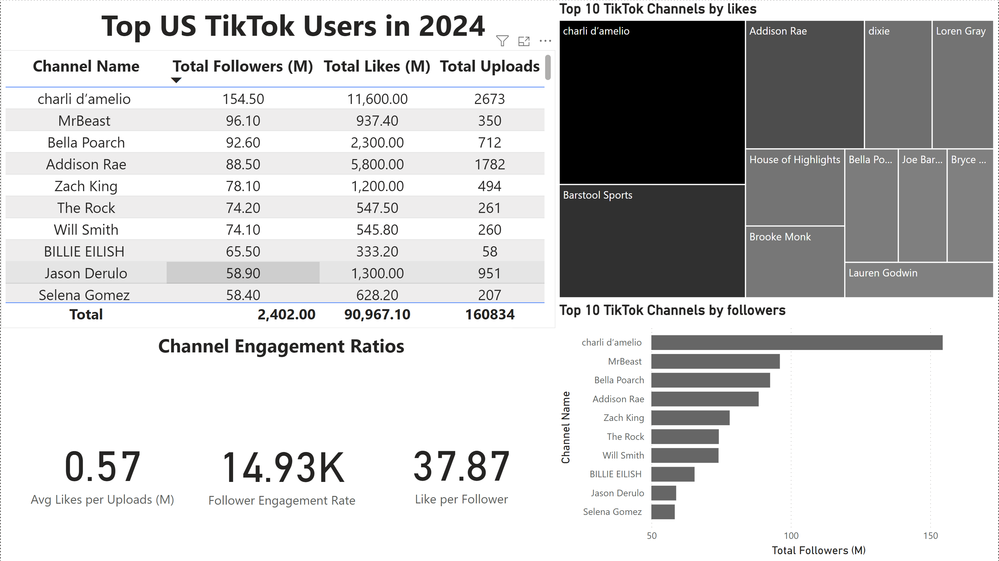

# Top US TikTok Channels 2024


# Table of contents 

- [Objective](#objective)
- [Data Source](#data-source)
- [Stages](#stages)
- [Design](#design)
  - [Dashboard mockup](#dashboard-mockup)
  - [Tools](#tools)
- [Development](#development)
  - [Pseudocode](#pseudocode)
  - [Data Exploration](#data-exploration-notes)
  - [Data Cleaning](#data-cleaning)
  - [Transform the Data](#transform-the-data)
  - [Create the SQL View](#create-the-sql-view)
- [Testing](#testing)
  - [Data Quality Tests](#row-count-check)
- [Visualization](#visualization)
  - [Results](#results)
  - [DAX Measures](#dax-measures)
- [Analysis](#analysis)
  - [Findings](#findings)
  - [Validation](#validation)
  - [Discovery](#discovery)
- [Recommendations](#recommendations)
  - [Potential ROI](#potential-roi)
- [Action Plan](#action-plan)


# Objective 

- What is the key pain point? 

The Head of Marketing wants to find out who the top TikTok Channels are in 2024 to decide on which TikTok Channels would be best to run marketing campaigns throughout the rest of the year.


- What is the ideal solution? 

To create a dashboard that provides insights into the top US TikTok Channels in 2024 that includes their 
- Follower Count
- Total Likes
- Total Uploads
- Engagement Metrics

This will help the marketing team make informed decisions about which TikTok Channels to collaborate with for their marketing campaigns.

## User story 

As the Head of Marketing, I want to use a dashboard that analyses TikTok channel data in the US. 

This dashboard should allow me to identify the top-performing channels based on metrics like follower base and average likes. 

With this information, I can make more informed decisions about which TikTok Channels are right to collaborate with, and therefore maximize how effective each marketing campaign is.


# Data source 

- What data is needed to achieve our objective?

We need data on the top US TikTok Channels in 2024 that includes their 
- Channel Names
- Total Followers
- Total Views
- Total Uploads


- Where is the data coming from? 
The data is sourced from [Kaggle (an Excel extract).](https://www.kaggle.com/datasets/bhavyadhingra00020/top-100-social-media-influencers-2024-countrywise?resource=download)


# Stages

- Design
- Development
- Testing
- Analysis 
 


# Design 

## Dashboard components required 
- What should the dashboard contain based on the requirements provided?

To understand what it should contain, we need to figure out what questions we need the dashboard to answer:

1. Who are the top 10 TikTok channels with the most followers?
2. Which 5 channels have uploaded the most uploads?
3. Which 5 channels have the most likes?
4. Which 5 channels have the highest average likes per upload?
5. Which 5 channels have the highest likes per follower ratio?
6. Which 5 channels have the highest follower engagement rate per upload?

For now, these are some of the questions we need to answer, this may change as we progress down our analysis. 


## Dashboard mockup

- What should it look like? 

Some of the data visuals that may be appropriate in answering our questions include:

1. Table
2. Treemap
3. Scorecards
4. Horizontal bar chart 


## Tools 


| Tool | Purpose |
| --- | --- |
| Excel | Exploring the data |
| SQL Server | Cleaning, testing, and analyzing the data |
| Power BI | Visualizing the data via interactive dashboards |
| GitHub | Hosting the project documentation and version control |


# Development

## Pseudocode

- What's the general approach in creating this solution from start to finish?

1. Get the data
2. Explore the data in Excel
3. Load the data into SQL Server
4. Clean the data with SQL
5. Test the data with SQL
6. Visualize the data in Power BI
7. Generate the findings based on the insights
8. Write the documentation + commentary
9. Publish the data to GitHub Pages

## Data exploration notes

This is the stage where you have a scan of what's in the data, errors, inconsistencies, bugs, weird and corrupted characters, etc.  


- What are your initial observations with this dataset? What's caught your attention so far? 

1. There are at least 4 columns that contain the data we need for this analysis, which signals we have everything we need from the file without needing to contact the client for any more data. 
2. The first column contains the channel ID with what appears to be channel IDS, which are separated by a @ symbol - we need to extract the channel names from this.
3. The true data wasn't fully correct has there were a number of channels based in the US that were not on the list but had more followers than the rest.
4. The 2 other columns needed for the data analysis were not in the dataset so I had to find the total likes and total uploads for the top US TikTok channels.
5. The total followers and total like columns were also made with strings to substitute the 0's with M and B standing for million and billion respectively.
6. We have more data than we need, so some of these columns would need to be removed.


## Data cleaning 
- What do we expect the clean data to look like? (What should it contain? What constraints should we apply to it?)

The aim is to refine our dataset to ensure it is structured and ready for analysis. 

The cleaned data should meet the following criteria and constraints:

- Only relevant columns should be retained.
- All data types should be appropriate for the contents of each column.
- No column should contain null values, indicating complete data for all records.

Below is a table outlining the constraints on our cleaned dataset:

| Property | Description |
| --- | --- |
| Number of Rows | 100 |
| Number of Columns | 4 |

And here is a tabular representation of the expected schema for the clean data:

| Column Name | Data Type | Nullable |
| --- | --- | --- |
| channel_name | VARCHAR | NO |
| total_subscribers | INTEGER | NO |
| total_views | INTEGER | NO |
| total_videos | INTEGER | NO |


- What steps are needed to clean and shape the data into the desired format?

1. Remove unnecessary columns by only selecting the ones you need
2. Extract TikTok channel names from the first column
3. Rename columns using aliases


### Transform the data 


```sql
/*
1. Remove unessary columns by only selecting the ones we need
2. Extract the Tik Tok channel names from the first columns
3. Rename the column names
*/

-- 1.
SELECT
    CAST(SUBSTRING(NAME, 1, CHARINDEX('@', NAME) -1) AS VARCHAR(100)) AS CHANNEL_NAME,
	CASE
        WHEN FOLLOWERS LIKE '%M' THEN CAST(CAST(SUBSTRING(FOLLOWERS, 1, LEN(FOLLOWERS) - 1) AS FLOAT) * 1000000 AS BIGINT)
        WHEN FOLLOWERS LIKE '%B' THEN CAST(CAST(SUBSTRING(FOLLOWERS, 1, LEN(FOLLOWERS) - 1) AS FLOAT) * 1000000000 AS BIGINT)
        ELSE CAST(CAST(FOLLOWERS AS FLOAT) AS BIGINT)
    END AS FOLLOWERS,
    CASE
        WHEN TOTAL_LIKES LIKE '%M' THEN CAST(CAST(SUBSTRING(TOTAL_LIKES, 1, LEN(TOTAL_LIKES) - 1) AS FLOAT) * 1000000 AS BIGINT)
        WHEN TOTAL_LIKES LIKE '%B' THEN CAST(CAST(SUBSTRING(TOTAL_LIKES, 1, LEN(TOTAL_LIKES) - 1) AS FLOAT) * 1000000000 AS BIGINT)
        ELSE CAST(CAST(TOTAL_LIKES AS FLOAT) AS BIGINT)
    END AS TOTAL_LIKES,
    TOTAL_UPLOADS
FROM 
    top_us_tiktok_users_2024;
```


### Create the SQL view 

```sql
/*
1. Remove unessary columns by only selecting the ones we need
2. Extract the Tik Tok channel names from the first columns
3. Rename the column names
*/

-- 1.
CREATE VIEW view_us_tiktok_users_2024 AS
-- 2.
SELECT
	CAST(SUBSTRING(NAME, 1, CHARINDEX('@', NAME) -1) AS VARCHAR(100)) AS CHANNEL_NAME,
	CASE
        WHEN FOLLOWERS LIKE '%M' THEN CAST(CAST(SUBSTRING(FOLLOWERS, 1, LEN(FOLLOWERS) - 1) AS FLOAT) * 1000000 AS BIGINT)
        WHEN FOLLOWERS LIKE '%B' THEN CAST(CAST(SUBSTRING(FOLLOWERS, 1, LEN(FOLLOWERS) - 1) AS FLOAT) * 1000000000 AS BIGINT)
        ELSE CAST(CAST(FOLLOWERS AS FLOAT) AS BIGINT)
    END AS FOLLOWERS,
    CASE
        WHEN TOTAL_LIKES LIKE '%M' THEN CAST(CAST(SUBSTRING(TOTAL_LIKES, 1, LEN(TOTAL_LIKES) - 1) AS FLOAT) * 1000000 AS BIGINT)
        WHEN TOTAL_LIKES LIKE '%B' THEN CAST(CAST(SUBSTRING(TOTAL_LIKES, 1, LEN(TOTAL_LIKES) - 1) AS FLOAT) * 1000000000 AS BIGINT)
        ELSE CAST(CAST(TOTAL_LIKES AS FLOAT) AS BIGINT)
    END AS TOTAL_LIKES,
    TOTAL_UPLOADS

-- 3.
FROM
    top_us_tiktok_users_2024;

```


# Testing 

- What data quality and validation checks are you going to create?

Here are the data quality tests conducted:

## Row count check
```sql
/*
# Count the total number of records (or rows) are in the SQL view
*/

SELECT
    COUNT(*) AS no_of_rows
FROM
    view_us_tiktok_users_2024;

```


## Column count check
### SQL query 
```sql
/*
# Count the total number of columns (or fields) are in the SQL view
*/


SELECT
    COUNT(*) AS column_count
FROM
    INFORMATION_SCHEMA.COLUMNS
WHERE
    TABLE_NAME = 'view_us_tiktok_users_2024'
```


## Data type check
### SQL query 
```sql
/*
# Check the data types of each column from the view by checking the INFORMATION SCHEMA view
*/

-- 1.
SELECT
    COLUMN_NAME,
    DATA_TYPE
FROM
    INFORMATION_SCHEMA.COLUMNS
WHERE
    TABLE_NAME = 'view_us_tiktok_users_2024';
```


## Duplicate count check
### SQL query 
```sql
/*
# 1. Check for duplicate rows in the view
# 2. Group by the channel name
# 3. Filter for groups with more than one row
*/

-- 1.
SELECT
    CHANNEL_NAME,
    COUNT(*) AS duplicate_count
FROM
    view_us_tiktok_users_2024

-- 2.
GROUP BY
    CHANNEL_NAME

-- 3.
HAVING
    COUNT(*) > 1;
```

# Visualization 


## Results

- What does the dashboard look like?



This shows the Top US TikTok Channels in 2024 so far. 


## DAX Measures

### 1. Total Followers (M)
```sql
Total Followers (M) = 
VAR million = 1000000
VAR sum_of_followers = SUM(view_us_tiktok_users_2024[FOLLOWERS])
VAR total_followers = DIVIDE(sum_of_followers, million)

RETURN total_followers

```

### 2. Total Likes (M)
```sql
Total Likes (M) = 
VAR million = 1000000
VAR sum_of_total_likes = SUM(view_us_tiktok_users_2024[TOTAL_LIKES])
VAR total_likes =  DIVIDE(sum_of_total_likes, million)

RETURN total_likes

```

### 3. Total Uploads
```sql
Total Uploads = 
VAR total_uploads = SUM(view_us_tiktok_users_2024[TOTAL_UPLOADS])

RETURN total_uploads


```

### 4. Average Likes Per Uploads (M)
```sql
Avg Likes per Uploads (M) = 
VAR sum_of_total_likes = SUM(view_us_tiktok_users_2024[TOTAL_LIKES])
VAR sum_of_total_uploads = SUM(view_us_tiktok_users_2024[TOTAL_UPLOADS])
VAR avg_likes_per_uploads = DIVIDE(sum_of_total_likes, sum_of_total_uploads, BLANK())
VAR final_avg_likes_per_uploads = DIVIDE(avg_likes_per_uploads, 1000000, BLANK())

RETURN final_avg_likes_per_uploads

```


### 5. Follower Engagement Rate
```sql
Follower Engagement Rate = 
VAR sum_of_total_followers = SUM(view_us_tiktok_users_2024[FOLLOWERS])
VAR sum_of_total_uploads = SUM(view_us_tiktok_users_2024[TOTAL_UPLOADS])
VAR follower_eng_rate = DIVIDE(sum_of_total_followers, sum_of_total_uploads, BLANK())

RETURN follower_eng_rate

```


### 6. Likes per Follower
```sql
Like per Follower = 
VAR sum_of_total_likes = SUM(view_us_tiktok_users_2024[TOTAL_LIKES])
VAR sum_of_total_followers = SUM(view_us_tiktok_users_2024[FOLLOWERS])
VAR likes_per_followers = DIVIDE(sum_of_total_likes, sum_of_total_followers, BLANK())

RETURN likes_per_followers

```


# Analysis 

## Findings

- What did we find?

For this analysis, we're going to focus on the questions below to get the information we need for our marketing client - 

Here are the key questions we need to answer for our marketing client: 
1. Who are the top 10 TikTok channels with the most followers?
2. Which 5 channels have uploaded the most uploads?
3. Which 5 channels have the most likes?
4. Which 5 channels have the highest average likes per upload?
5. Which 5 channels have the highest likes per follower ratio?
6. Which 5 channels have the highest follower engagement rate per upload?


### 1. Who are the top 10 TikTok channels with the most followers?

| Rank | Channel Name         | Total Followers (M) |
|------|----------------------|---------------------|
| 1    | charli d’amelio      | 154.50              |
| 2    | MrBeast              | 96.10               |
| 3    | Bella Poarch         | 92.60               |
| 4    | Addison Rae          | 88.50               |
| 5    | Zach King            | 78.10               |
| 6    | The Rock             | 74.20               |
| 7    | Will Smith           | 74.10               |
| 8    | BILLIE EILISH        | 65.50               |
| 9    | Jason Derulo         | 58.90               |
| 10   | Selena Gomez         | 58.40               |


### 2. Which 5 channels have uploaded the most uploads?

| Rank | Channel Name         | Uploads         |
|------|----------------------|-----------------|
| 1    | Barstool Sports      | 17,900          |
| 2    | House of Highlights  | 9,862           |
| 3    | Gary Vaynerchuk      | 7,457           |
| 4    | Lauren Godwin        | 5,022           |
| 5    | anna x               | 4,805           |


### 3. Which 5 channels have the most likes?


| Rank | Channel Name     | Total Likes (B) |
|------|------------------|-----------------|
| 1    | charli d’amelio  | 11.6            |
| 2    | Barstool Sports  | 8.0             |
| 3    | Addison Rae      | 5.8             |
| 4    | dixie            | 3.3             |
| 5    | Loren Gray       | 3.0             |


### 4. Which 5 channels have the highest average likes per upload?

| Rank | Channel Name     | Average Likes per Uploads (M)|
|------|------------------|------------------------------|
| 1    | BILLIE EILISH    | 5.74                         |
| 2    | charli d’amelio  | 4.34                         |
| 3    | dixie            | 3.85                         |
| 4    | Nikita Dragun    | 3.63                         |
| 5    | Kylie Jenner     | 3.28                         |


### 5. Which 5 channels have the highest likes per follower ratio?

| Rank | Channel Name        | Likes per Follower        |
|------|---------------------|---------------------------|
| 1    | House of Highlights | 228.35                    |
| 2    | Barstool Sports     | 216.80                    |
| 3    | anna x              | 150.00                    |
| 4    | Joe Bartolozzi      | 113.51                    |
| 5    | Hope Schwing        | 100.00                    |


### 6. Which 5 channels have the highest follower engagement rate per upload?

| Rank | Channel Name    | Follower Engagement Rate |
|------|-----------------|--------------------------|
| 1    | BILLIE EILISH   | 1,129,310.34             |
| 2    | Will Smith      | 285,000.00               |
| 3    | The Rock        | 284,291.19               |
| 4    | Selena Gomez    | 282,125.60               |
| 5    | MrBeast         | 274,571.43               |


### Notes

For this analysis, we'll prioritize analyzing the metrics that are important in generating the expected ROI for our marketing client, which are the TikTok channels with the most:

- Total Followers
- Total Likes
- Uploads


## Validation 

### TikTok Channels with the most followers 

#### Calculation breakdown

Campaign idea = product placement 

1. Charli D'amelio 
- Average likes per upload = 4.34 million
- Product cost = $7.5
- Potential units sold per upload = 4.34 million x 2% conversion rate = 86,800 units sold
- Potential revenue per upload = 86,800 x $7.5 = $651,000
- Campaign cost (one-time fee) = $75,000
- **Net profit = $651,000 - $75,000 = $576,000**

b. MrBeast

- Average likes per upload = 2.68 million
- Product cost = $7.5
- Potential units sold per upload = 2.68 million x 2% conversion rate = 53,600 units sold
- Potential revenue per upload = 53,600 x $7.5 = $402,000
- Campaign cost (one-time fee) = $75,000
- **Net profit = $402,000 - $75,000 = $327,000**

c. Bella Poarch

- Average likes per upload = 3.23 million
- Product cost = $7.5
- Potential units sold per upload = 3.23 million x 2% conversion rate = 64,600 units sold
- Potential revenue per upload = 64,600 x $7.5 = $484,500
- Campaign cost (one-time fee) = $75,000
- **Net profit = $484,500 - $75,000 = $409,500**

d. Addison Rae

- Average likes per upload = 3.25 million
- Product cost = $7.5
- Potential units sold per upload = 3.25 million x 2% conversion rate = 65,000 units sold
- Potential revenue per upload = 65,000 x $7.5 = $487,500
- Campaign cost (one-time fee) = $75,000
- **Net profit = $487,500 - $75,000 = $412,500**

e. Zach King

- Average likes per upload = 2.43 million
- Product cost = $7.5
- Potential units sold per upload = 2.43 million x 2% conversion rate = 48,600 units sold
- Potential revenue per upload = 48,600 x $7.5 = $364,500
- Campaign cost (one-time fee) = $75,000
- **Net profit = $364,500 - $75,000 = $289,500**


Best option from category: MrBeast


#### SQL query 

```sql
/* 

# 1. Define the variables
# 2. Create a CTE that rounds the average likes per upload
# 3. Select the columns that are required for the analysis
# 4. Filter the results by the Tik Tok channels with the highest follower bases
# 5. Order by net_profit (from highest to lowest

*/


-- 1. 
DECLARE @conversionRate FLOAT = 0.02;		-- The conversion rate @ 2%
DECLARE @productCost FLOAT = 7.5;			-- The product cost @ $7.5
DECLARE @campaignCost FLOAT = 75000.0;		-- The campaign cost @ $75,000	


-- 2.  
WITH ChannelData AS (
	SELECT CHANNEL_NAME, TOTAL_LIKES, TOTAL_UPLOADS, 
	CASE 
        WHEN TOTAL_UPLOADS = 0 THEN 0 
        ELSE ROUND((CAST(TOTAL_LIKES as FLOAT) / TOTAL_UPLOADS), -4) 
	END AS ROUNDED_AVG_LIKES_PER_UPLOAD,
	CASE 
        WHEN TOTAL_UPLOADS = 0 THEN 0 
        ELSE (TOTAL_LIKES/ TOTAL_UPLOADS)
	END AS ORIGINAL_AVG_LIKES_PER_UPLOAD

	FROM tiktok_db.dbo.view_us_tiktok_users_2024
	)

-- 3. 
SELECT 
	CHANNEL_NAME,
	ROUNDED_AVG_LIKES_PER_UPLOAD, 
	(ROUNDED_AVG_LIKES_PER_UPLOAD *@conversionRate) AS POTENTIAL_UNITS_SOLD_PER_UPLOAD, 
	(ROUNDED_AVG_LIKES_PER_UPLOAD *@conversionRate * @productCost) AS POTENTIAL_REVENUE_PER_UPLOAD,  
	(ROUNDED_AVG_LIKES_PER_UPLOAD *@conversionRate * @productCost) - @campaignCost AS net_profit

FROM ChannelData


-- 4. 
WHERE CHANNEL_NAME IN ('charli d’amelio ','MrBeast ','Bella Poarch ','Addison Rae ','Zach King ')

-- 5.
ORDER BY net_profit DESC


```


## Discovery

- What did we learn?

We discovered that 


1. charli d’amelio, MrBeast, and Bella Poarch are the channels with the most followers in the US.
2. Barstool Sports, House of Highlights, and IdeaTime Everywhere are the channels with the most uploads.
3. charli d’amelio, Barstool Sports, and Addison Rae are the channels with the most likes.
4. Generally, if a channel has fewer uploads but high followers/likes, it is more likely to have more engaged followers, making it a more focused channel for advertising campaigns.


## Recommendations 

- What do you recommend based on the insights gathered? 
  
Based on the data from the tables and the dashboard, it appears that MrBeast is the best option among the top 5 TikTok channels. His channel has the highest Follower Engagement Rate and the second-highest number of followers in the US. This shows that even with fewer uploads compared to the top channels, MrBeast's viewers are the most active and engaged, leading to a higher likelihood of turnout. Zach King's channel is similar to MrBeast's, but MrBeast has almost double Zach King's Follower Engagement Rate. Compared to these two channels, the other three—Charli D'Amelio, Bella Poarch, and Addison Rae—have more overall likes. However, this is likely due to the higher frequency of uploads by these channels, as opposed to the fewer uploads by MrBeast and Zach King.			


### Potential ROI 
- What ROI do we expect if we take this course of action?

1. Setting up a collaboration deal with MrBeast would make the client a net profit of $327,000 per upload
2. An influencer marketing contract with Charli D'amelio can see the client generate a net profit of $576,000 per upload.
3. If we go with a product placement campaign with Bella Poarch, this could generate the client approximately $409,500 per upload.
4. Zach King could profit the client $289,500 per video too (which is worth considering)
5. An influencer such as Addison Rae could generate a profit of $412,500 per upload.


### Action plan
- What course of action should we take and why?

Based on our analysis, we believe the best channel to advance a long-term partnership deal with to promote the client's products is the MrBeast channel. 

We'll have conversations with the marketing client to forecast what they also expect from this collaboration. Once we observe we're hitting the expected milestones, we'll advance with potential partnerships with Charli D'amelio, Bella Poarch, Zach King, and Addison Rae channels in the future.   

- What steps do we take to implement the recommended decisions effectively?


1. Reach out to the teams behind each of these channels, starting with MrBeast.
2. Negotiate contracts within the budgets allocated to each marketing campaign.
3. Kick off the campaigns and track each of their performances against the KPIs.
4. Review how the campaigns have gone, gather insights, and optimize based on feedback from converted customers and each channel's audiences.
